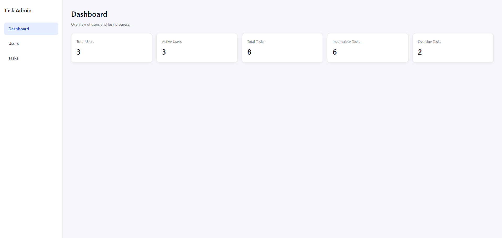
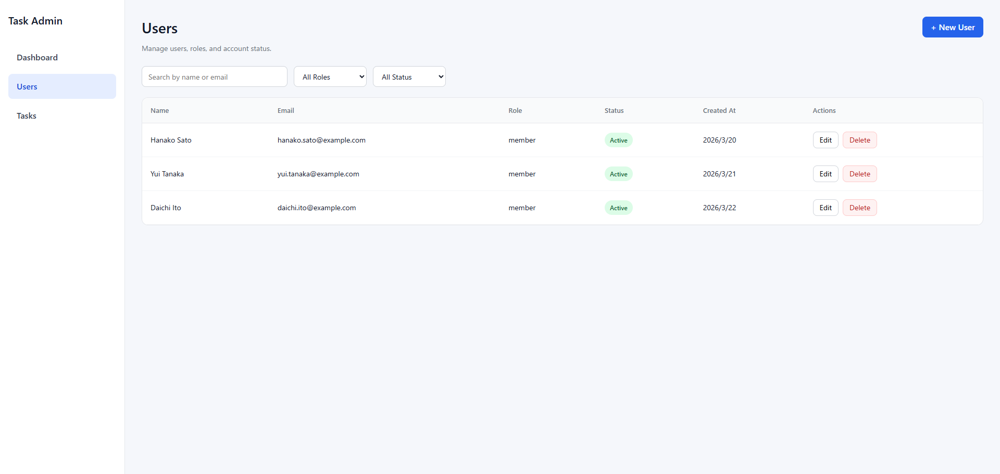
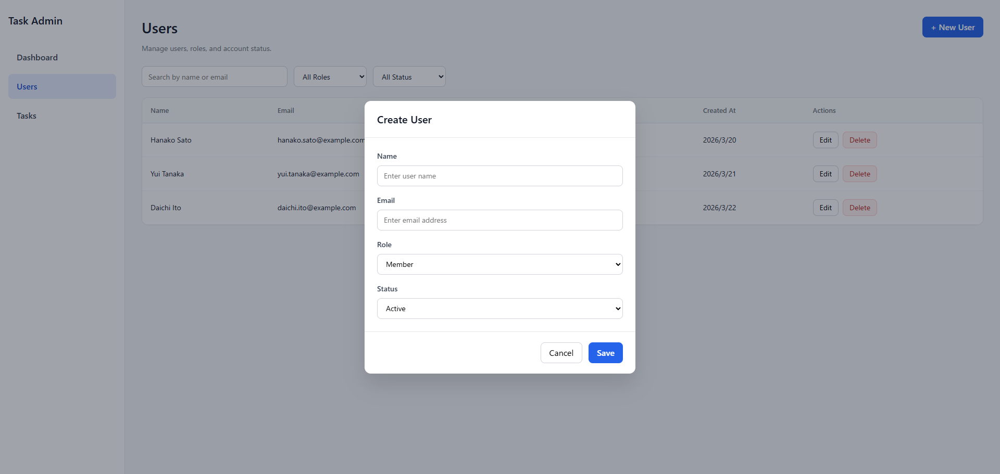
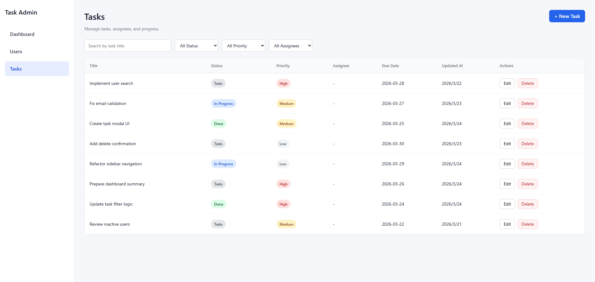
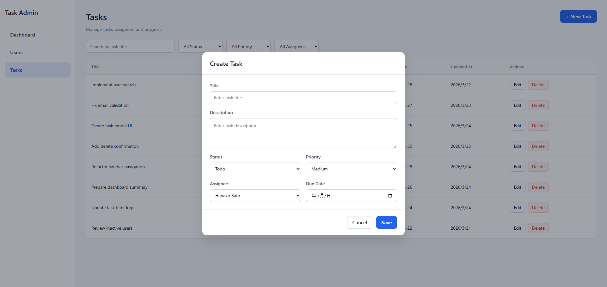

# Task & User Management App

## 概要
React + TypeScript で作成した、業務向け管理画面を想定したポートフォリオです。  
ユーザー管理とタスク管理を行う CRUD アプリとして構成しています。

実務でよくある以下のような機能を意識して実装しています。

- 一覧表示
- 検索
- 絞り込み
- 新規作成
- 編集
- 削除
- モーダルフォーム
- 削除確認ダイアログ
- 通知表示
- ダッシュボード表示

---

## 主な機能

### ダッシュボード
- 総ユーザー数の表示
- 有効ユーザー数の表示
- 総タスク数の表示
- 未完了タスク数の表示
- 期限超過タスク数の表示

### ユーザー管理
- ユーザー一覧表示
- 名前 / メールアドレスでの検索
- 権限での絞り込み
- ステータスでの絞り込み
- ユーザー新規作成
- ユーザー編集
- ユーザー削除

### タスク管理
- タスク一覧表示
- タスク名での検索
- ステータスでの絞り込み
- 優先度での絞り込み
- 担当者での絞り込み
- タスク新規作成
- タスク編集
- タスク削除

---

## 使用技術
- React
- TypeScript
- Vite
- axios
- react-hook-form
- react-router-dom
- json-server

---

## 設計方針
このアプリでは、責務を分離しやすくするために **Container / Presentation** 構成を採用しています。

### 意識したポイント
- Container コンポーネントで状態管理・API呼び出し・イベント処理を担当
- Presentation コンポーネントで表示のみを担当
- API呼び出しは service 層に分離
- mock API として json-server を利用

---

## 画面一覧
- `/dashboard`
- `/users`
- `/tasks`

---

## 画面イメージ






---

## 画面・UIのポイント
- サイドバー付きレイアウト
- ダッシュボードのサマリーカード表示
- 検索・絞り込み機能
- 作成 / 編集用モーダル
- 削除確認ダイアログ
- Toast 通知
- Status / Priority の Badge 表示

---

## ディレクトリ構成
```txt
src/
  app/
    router.tsx
  components/
    common/
    dashboard/
    layout/
    tasks/
    users/
  mocks/
    db.json
  pages/
    DashboardPage.tsx
    TasksPage.tsx
    UsersPage.tsx
  services/
    apiClient.ts
    tasksService.ts
    usersService.ts
  types/
    dashboard.ts
    task.ts
    user.ts
  utils/
    date.ts
    filters.ts