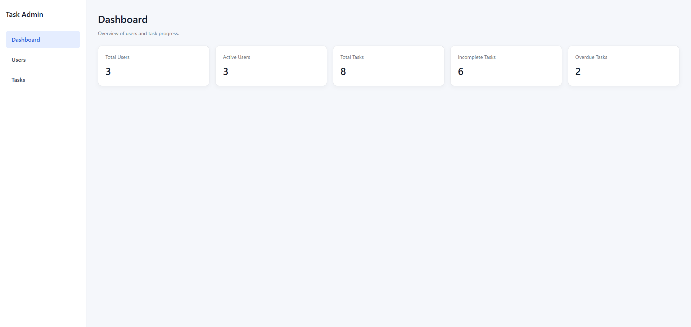
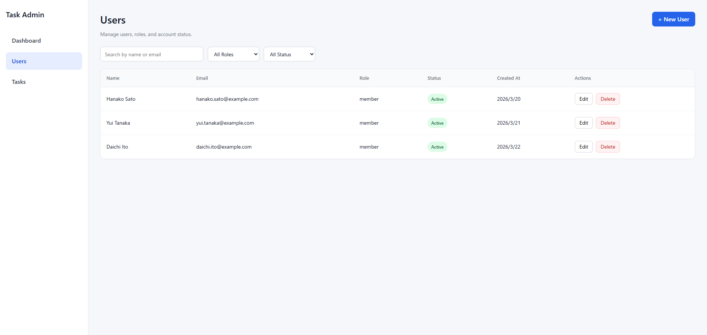
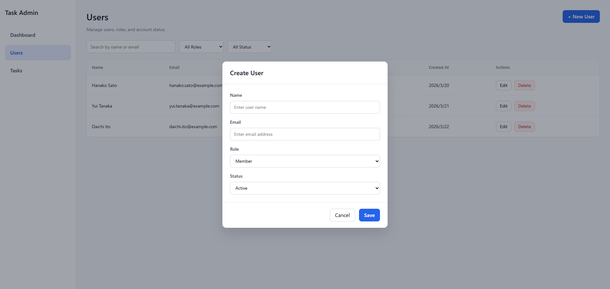
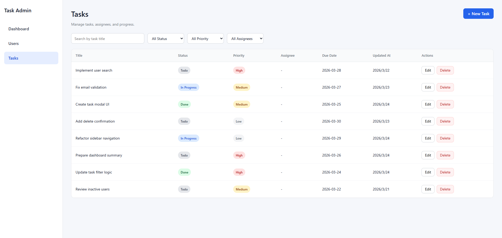
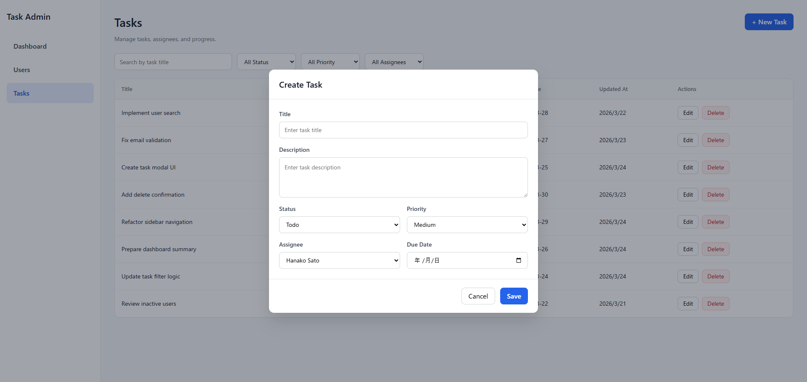

# Task & User Management App

React + TypeScript で作成した、**業務向けのユーザー管理・タスク管理アプリ**です。  
一覧表示、検索、絞り込み、CRUD、モーダルフォーム、削除確認、ダッシュボード集計など、実務でよくある管理画面の機能を意識して作成しました。

## URL

- Demo: https://task-user-management-app.vercel.app/dashboard
- GitHub: https://github.com/ippo328/task-user-management-app

---

## 作成目的

フロントエンドのポートフォリオとして、**業務システムを想定した管理画面**を作成しました。

単純なToDoアプリではなく、以下を意識しています。

- ユーザー管理
- タスク管理
- ダッシュボードによる集計表示
- 検索 / 絞り込み
- モーダルでの作成 / 編集
- 削除確認ダイアログ
- 通知表示

---

## 想定利用シーン

社内管理システムや業務支援システムを想定しています。

- ユーザー情報の管理
- タスクの登録 / 編集 / 削除
- ステータスや優先度による管理
- 担当者ごとの確認
- ダッシュボードでの状況把握

---

## 主な機能

### ダッシュボード
- 総ユーザー数の表示
- 有効ユーザー数の表示
- 総タスク数の表示
- 未完了タスク数の表示
- 期限超過タスク数の表示

### ユーザー管理
- ユーザー一覧表示
- 名前 / メールアドレスでの検索
- 権限での絞り込み
- ステータスでの絞り込み
- ユーザー新規作成
- ユーザー編集
- ユーザー削除
- 担当タスクが存在するユーザーの削除ガード

### タスク管理
- タスク一覧表示
- タスク名での検索
- ステータスでの絞り込み
- 優先度での絞り込み
- 担当者での絞り込み
- タスク新規作成
- タスク編集
- タスク削除

### 画面状態
- ローディング表示
- エラー表示
- 0件表示
- 再読み込み導線

---

## 画面一覧

- `/dashboard`
- `/users`
- `/tasks`

---

## 画面イメージ







---

## 使用技術

- React
- TypeScript
- Vite
- axios
- react-hook-form
- react-router-dom
- json-server
- dayjs
- ESLint

---

## 設計・構成で意識した点

このアプリでは、責務を分離しやすくするために **Container / Presentation 構成** を意識しています。

### ポイント
- Container コンポーネントで状態管理・API呼び出し・イベント処理を担当
- Presentation コンポーネントで表示を担当
- API呼び出しは `services` に分離
- mock API として `json-server` を利用
- 将来的に本番APIへ差し替えやすい構成を意識

---

## 工夫した点

- 業務画面を意識し、ユーザー管理とタスク管理の2機能を1つのアプリにまとめた
- ダッシュボードで全体状況を把握できるようにした
- 検索 / 絞り込み / CRUD を一通り揃え、管理画面らしい操作性を意識した
- モーダルフォームや削除確認ダイアログを導入し、実務画面に近いUIを意識した
- API呼び出しを service 層に分離し、見通しと保守性を意識した
- データ整合性を見直し、担当タスクを持つユーザーは削除できないようにした
- 一覧画面にローディング、エラー、0件、再読み込みの状態を追加した

---

## 苦労した点

- 画面表示とロジックを分離しながら実装する構成整理
- ユーザー管理とタスク管理で共通する一覧画面の操作感の統一
- フォーム入力、更新、削除確認、通知表示など、管理画面に必要な挙動の整理
- mock API 前提でも、本番APIへ差し替えやすい構成を意識したこと
- ユーザーとタスクの参照整合性を保ちながら削除制御を追加したこと

---

## このアプリについて

このアプリは、**mock API（json-server）を利用したフロントエンドポートフォリオ**です。  
フロントエンドは Vercel、mock API は Render 上で公開しています。  
フロントエンド側では API 呼び出しを service 層に分離することで、将来的に本番APIへ差し替えしやすい構成を意識しています。

> ※ mock API は無料枠を利用しているため、初回アクセス時に少し時間がかかる場合があります。

---

## セットアップ

### 1. リポジトリをクローン

```bash
git clone https://github.com/ippo328/task-user-management-app.git
cd task-user-management-app